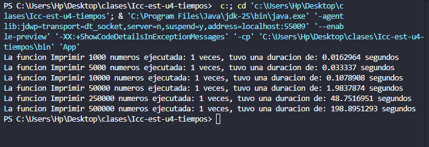

# Búsqueda Binaria

**Estudiante:** Joshue Avecillas

## Práctica -- Búsqueda Binaria con Personas

Esta práctica implementa la búsqueda binaria utilizando una estructura
de objetos `Persona`, organizada en un proyecto con modelo, controlador
y vista.

El programa permite:
- Ingresar una lista de personas (nombre y edad).
- Ordenarlas por edad.
- Buscar una edad específica usando búsqueda binaria.
- Mostrar cada paso del proceso mediante la clase `ShowConsole`.

## Salida del Programa

